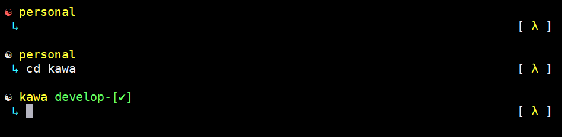

# Enlightenment - Oh My Zsh Theme



## Features
 - Displays git branch and clean/dirty indicator.
 - Prefix symbol changes colors depending on what mode you are in (vi mode)
 - Symbols appear letting you know you have lein and python installed.
 - Display the number of seconds it took for the last command to execute if it
   takes longer than 5 seconds.

## Installation

Copy or symlink.
```bash
cp enlightenment.zsh-theme ~/.oh-my-zsh/custom/themes
ln -s /path/to/enlightenment.zsh-theme ~/.oh-my-zsh/custom/themes
```
