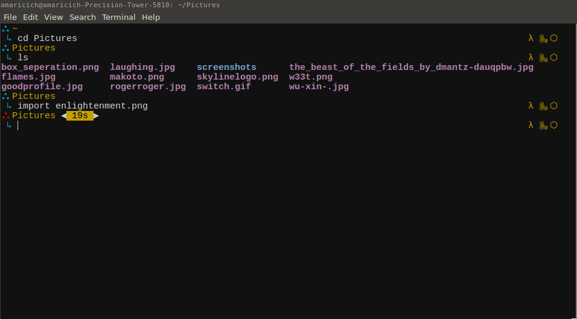

# Enlightenment - Oh My Zsh Theme

## Features
 - Displays git branch and clean/dirty indicator.
 - Prefix symbol changes colors depending on what mode you are in (vi mode)
 - Display software versions EG: python 2.7.12 / clojure 1.9.0-alpha15
 - Symbols appear letting you know you have lein, python, and nvm installed.
 - Display the number of seconds it took for the last command to execute if it
   takes longer than 5 seconds.

## Images

Here is an image that dispalys both the time it took to run a command as well as
how it looks when the terminal is in normal mode, instead of insert.

